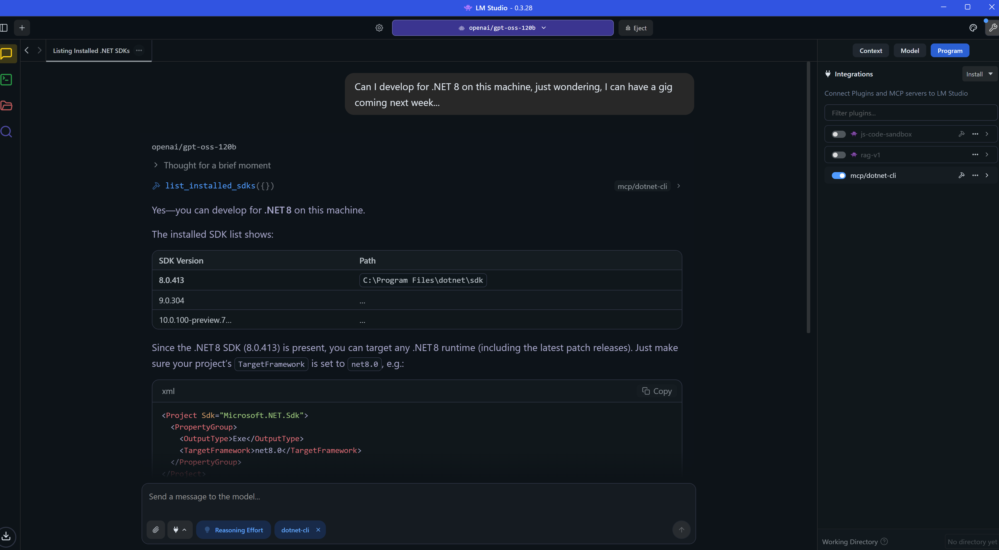
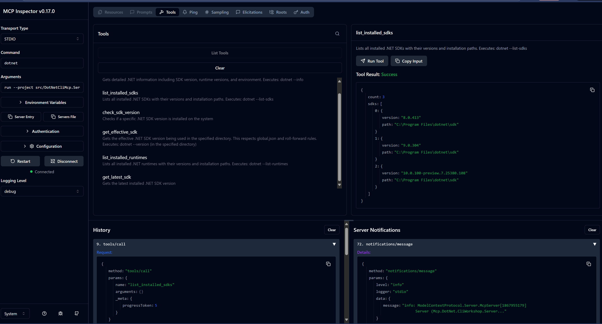
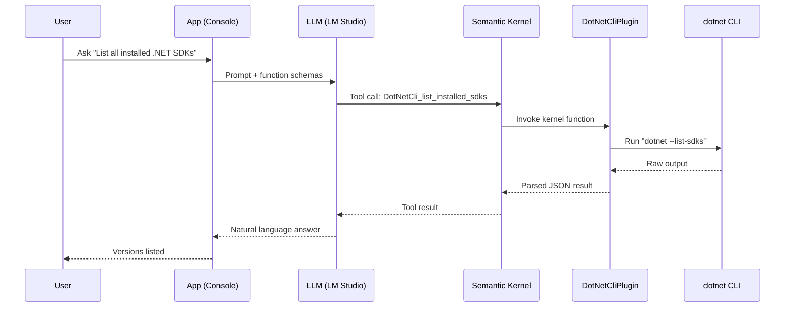
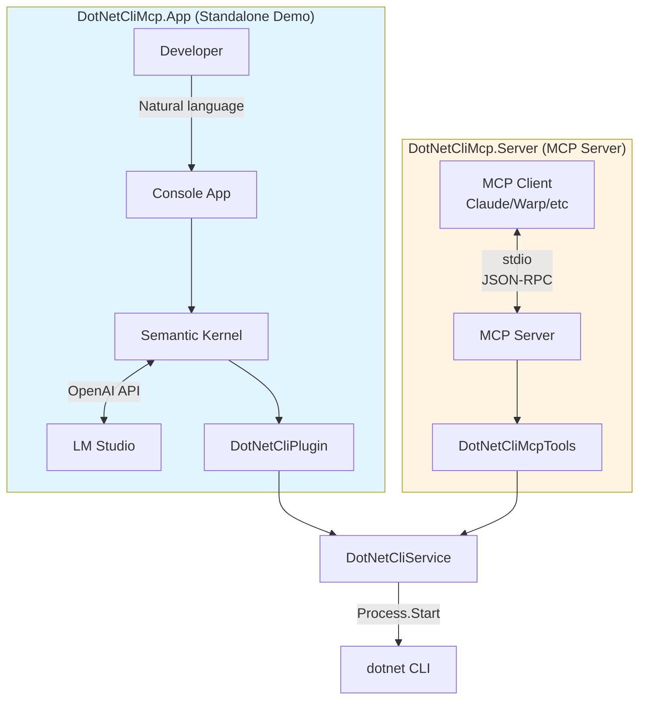
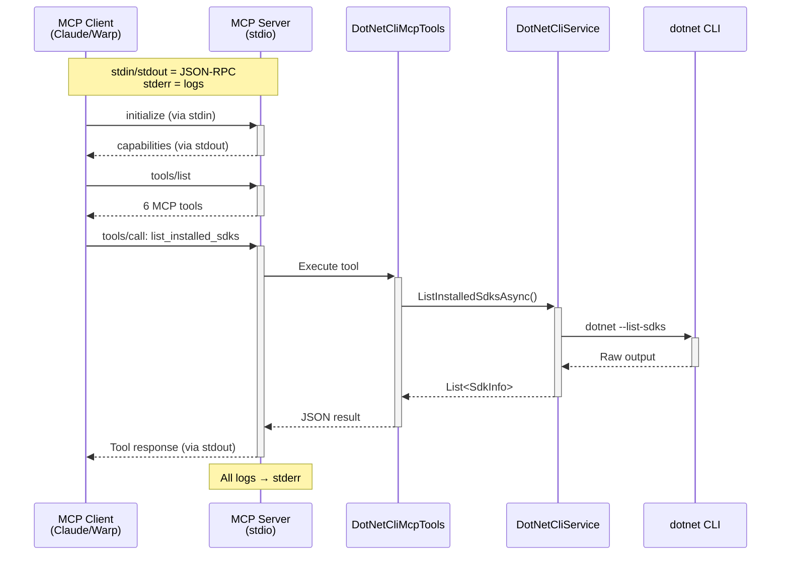
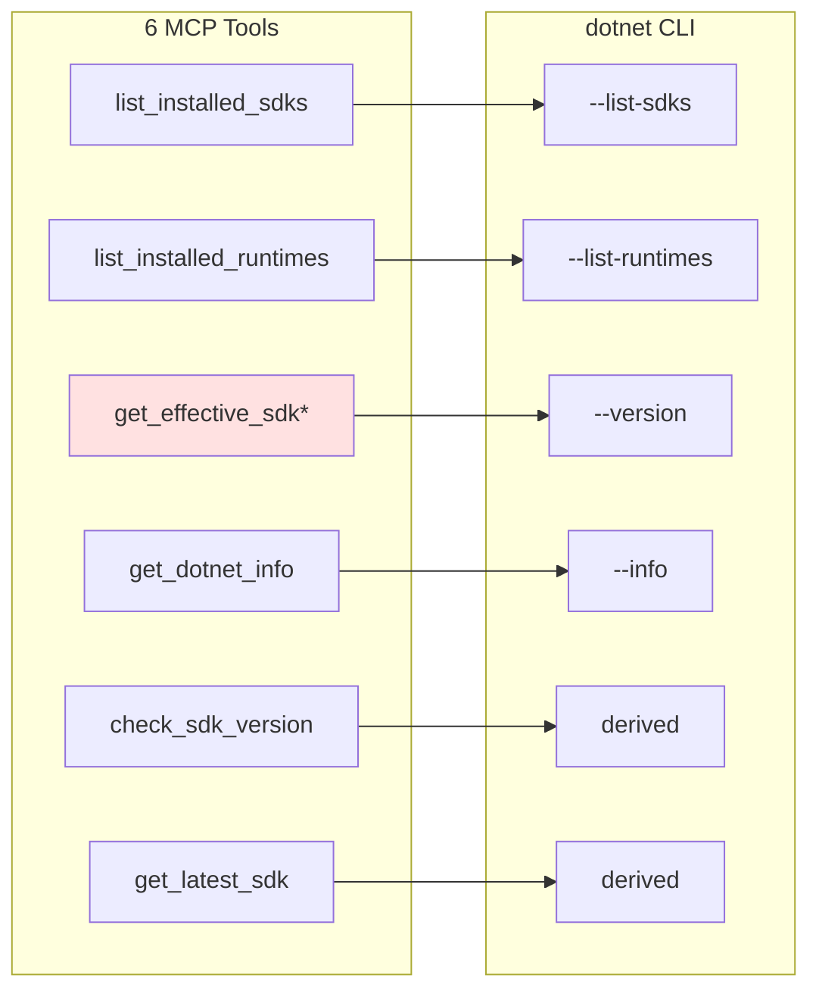
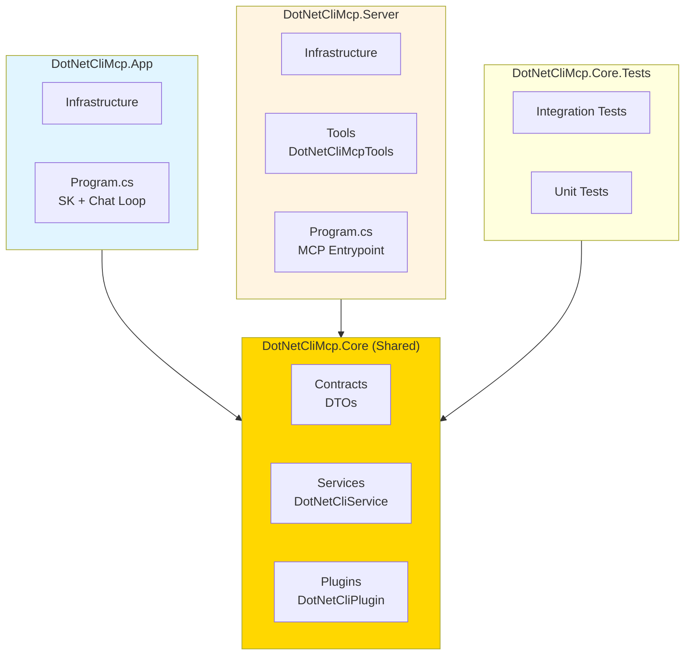
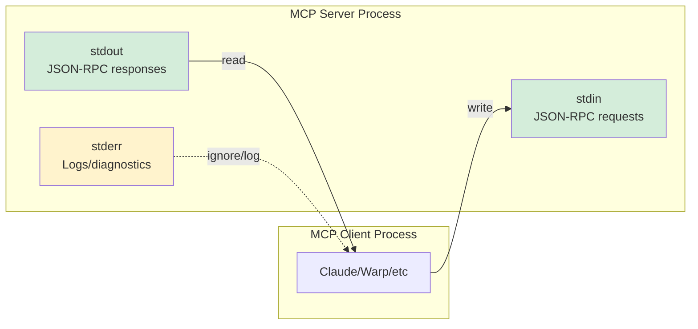
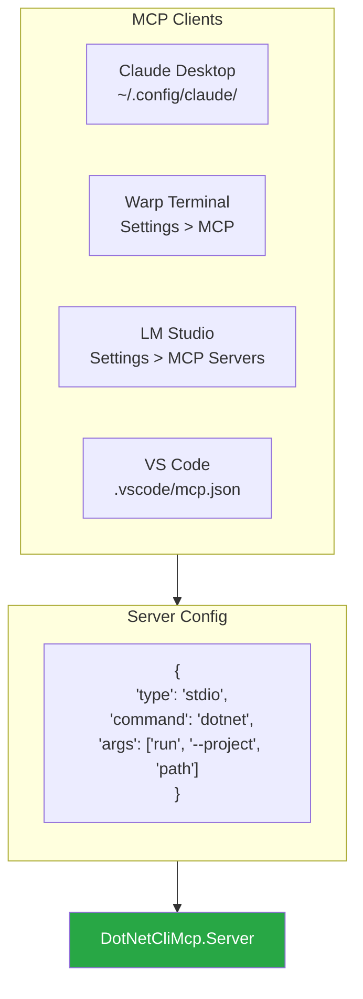
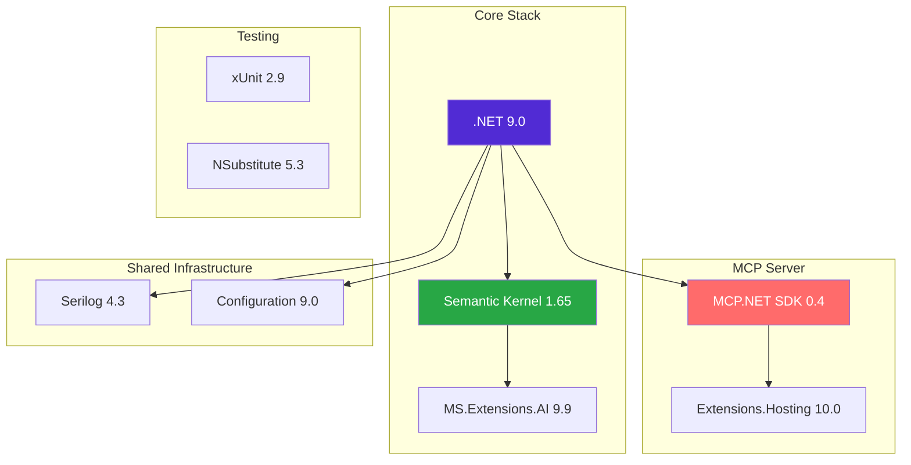

# Prompt to .NET CLI with MCP

A .NET 9 sample that turns natural language into `dotnet` CLI commands via Semantic Kernel + local LLM, enabling AI-powered interactions with your .NET environment.

> **Workshop Materials**: This project serves as the foundation for a hands-on workshop teaching MCP integration, Semantic Kernel agents, and LLM tool calling. See [WORKSHOP-DRAFT.md](WORKSHOP-DRAFT.md) for the full workshop curriculum.





## How It Works

> **TL;DR;**: Two modes in one repo: (1) **MCP Server** - exposes .NET CLI tools via stdio transport for MCP clients (Claude, Warp, LM Studio), and (2) **SK Chat App** - standalone Semantic Kernel demo with auto-function calling to query your .NET environment using natural language + local LLM.

- The LLM chooses an MCP function based on your question.
- Semantic Kernel auto-invokes the function and returns structured results.
- The app summarizes the results into a concise answer.

```bash
dotnet run --project src\DotNetCliMcp.App\DotNetCliMcp.App.csproj

[18:41:15 INF] Starting Prompt to .NET CLI with MCP
[18:41:15 INF] Semantic Kernel initialized with 1 plugins
[18:41:15 INF] Available functions: get_dotnet_info, list_installed_sdks, list_installed_runtimes, check_sdk_version, get_latest_sdk, get_effective_sdk
[18:41:15 INF] === Prompt to .NET CLI with MCP ===
[18:41:15 INF] Connected to LM Studio at: http://127.0.0.1:1234/v1
[18:41:15 INF] HTTP timeout: 300s (0=infinite), Connect timeout: 15s
[18:41:15 WRN] Note: Make sure LM Studio is running with a model loaded
[18:41:15 INF] Type your questions about .NET SDK/Runtime (or 'exit' to quit)
[18:41:15 INF] 
You: list all my installed .net runtimes
[18:41:24 INF] Processing user query: list all my installed .net runtimes

Assistant: \[18:41:25 INF] Plugin function list_installed_runtimes invoked
[18:41:25 INF] Executing dotnet --list-runtimes
[18:41:25 INF] Found 9 installed runtimes
You have the following .NET runtimes installed:

- **Microsoft.AspNetCore.App** 8.0.19  
- **Microsoft.AspNetCore.App** 9.0.8  
- **Microsoft.AspNetCore.App** 10.0.0‑preview.7.25380.108  

- **Microsoft.NETCore.App** 8.0.19  
- **Microsoft.NETCore.App** 9.0.8  
- **Microsoft.NETCore.App** 10.0.0‑preview.7.25380.108  

- **Microsoft.WindowsDesktop.App** 8.0.19  
- **Microsoft.WindowsDesktop.App** 9.0.8  
- **Microsoft.WindowsDesktop.App** 10.0.0‑preview.7.25380.108  

All are located under `C:\Program Files\dotnet\shared`.
```

### You can have fun

```console
# Example (Polish)
User: jaki dzisiaj jest dzień tygodnia?
Assistant: Dziś jest niedziela.
```



## Features

- **Local LLM Integration**: Connects to LM Studio for privacy-focused AI interactions
- **MCP Server**: Exposes .NET CLI capabilities via stdio transport for MCP clients
- **DotNet CLI Wrapper**: Query SDK versions, runtimes, and environment details
- **MCP Functions**: Semantic Kernel plugin with tool calling support
- **Configuration Providers**: Uses appsettings.json and environment variables for flexible configuration
- **Enhanced System Prompts**: Optimized prompts for better tool calling and reasoning suppression
- **Structured Logging**: Serilog with console and file output
- **Comprehensive Testing**: xUnit 3 with NSubstitute mocking

## Architecture

### Two Modes: App vs Server



### MCP Server Flow (stdio transport)



## Prerequisites

- .NET 9.0 SDK
- [LM Studio](https://lmstudio.ai/) with a loaded model at `http://127.0.0.1:1234/v1`

## Quick Start

### Run Semantic Kernel Chat App

```bash
# One-shot setup (requires pwsh)
pwsh -File scripts/setup-collaborator.ps1

# Or manually
dotnet build
dotnet run --project src/DotNetCliMcp.App
```

Try prompts:
- List all installed .NET SDKs
- Do I have .NET 8.0.413 installed?
- Jaki jest mój aktualny SDK?

### Run MCP Server

```bash
# Run MCP server (for use with Claude/Warp/LM Studio)
dotnet run --project src/DotNetCliMcp.Server

# Or test with MCP Inspector
npx @modelcontextprotocol/inspector dotnet run --project src/DotNetCliMcp.Server
```

## Available MCP Functions



\* = Respects `global.json` configuration

## Project Structure



## Configuration

### stdio Transport (Critical for MCP)



⚠️ **Critical**: stdout must contain ONLY JSON-RPC. All logs go to stderr.

### DotNetCliMcp.App (LM Studio Demo)

```bash
export OpenAI__Endpoint="http://127.0.0.1:1234/v1"
export OpenAI__Model="your-model-name"
```

### DotNetCliMcp.Server (MCP Server)

```bash
# Tool-specific prefix prevents conflicts
export MCPDOTNETCLI_Logging__MinimumLevel=Debug
export MCPDOTNETCLI_Logging__File__Path=/var/log/mcp-dotnet-cli.log
export MCPDOTNETCLI_ENVIRONMENT=Development
```

### MCP Client Configuration



**Example** (Claude Desktop / Warp / LM Studio):

```json
{
  "servers": {
    "dotnet-cli": {
      "type": "stdio",
      "command": "dotnet",
      "args": ["run", "--project", "C:\\path\\to\\DotNetCliMcp.Server"],
      "env": {
        "MCPDOTNETCLI_Logging__MinimumLevel": "Information"
      }
    }
  }
}
```

## Development

```bash
dotnet build
dotnet test    # 20 tests
dotnet format
```

## Stack



## License

MIT License - See [LICENSE](LICENSE) for details.
