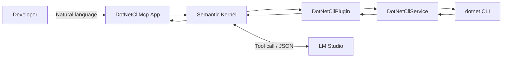
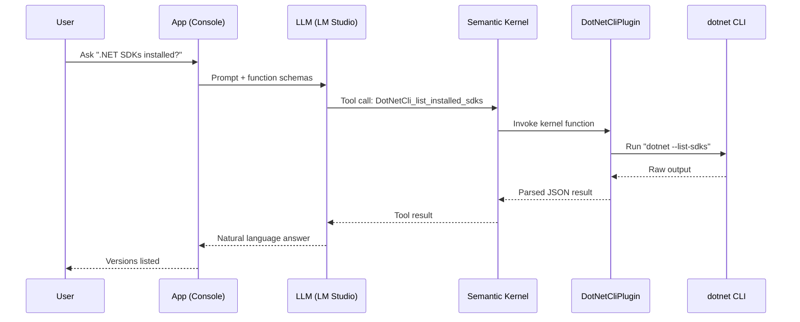

# Prompt to .NET CLI with MCP

```bash path=null start=null
dotnet run --project src/DotNetCliMcp.App

[17:24:38 INF] Starting Prompt to .NET CLI with MCP
[17:24:38 INF] Semantic Kernel initialized with 1 plugins
[17:24:38 INF] Available functions: get_dotnet_info, list_installed_sdks, list_installed_runtimes, check_sdk_version, get_latest_sdk
[17:24:38 INF] === Prompt to .NET CLI with MCP ===
[17:24:38 INF] Connected to LM Studio at: http://127.0.0.1:1234/v1
[17:24:38 WRN] Note: Make sure LM Studio is running with a model loaded
[17:24:38 INF] Type your questions about .NET SDK/Runtime (or 'exit' to quit)
[17:24:38 INF] 
You: give me a list of .net sdks installed on this machine
[17:24:52 INF] Processing user query: give me a list of .net sdks installed on this machine
[17:26:18 INF] Plugin function list_installed_sdks invoked
[17:26:18 INF] Executing dotnet --list-sdks
[17:26:18 INF] Found 9 installed SDKs

Assistant: Here's the list of .NET SDKs installed on this machine based on the tool result:

- **Version: 6.0.419**, Path: `/usr/local/share/dotnet/sdk`
- **Version: 8.0.120**, Path: `/usr/local/share/dotnet/sdk`
- **Version: 8.0.303**, Path: `/usr/local/share/dotnet/sdk`
- **Version: 8.0.403**, Path: `/usr/local/share/dotnet/sdk`
- **Version: 8.0.404**, Path: `/usr/local/share/dotnet/sdk`
- **Version: 9.0.100**, Path: `/usr/local/share/dotnet/sdk`
- **Version: 9.0.103**, Path: `/usr/local/share/dotnet/sdk`
- **Version: 9.0.203**, Path: `/usr/local/share/dotnet/sdk`
- **Version: 9.0.302**, Path: `/usr/local/share/dotnet/sdk`

If you have any questions or need further details, let me know!

You:
```

A .NET 9 sample that uses PromptBridge (our MCP tool) to turn natural language into `dotnet` CLI commands via Semantic Kernel, enabling LLM-powered interactions with your local .NET environment.

## Features

- **Local LLM Integration**: Connects to LM Studio for privacy-focused AI interactions
- **DotNet CLI Wrapper**: Query SDK versions, runtimes, and environment details
- **MCP Functions**: Semantic Kernel plugin with tool calling support
- **Configuration Providers**: Uses appsettings.json and environment variables for flexible configuration
- **Enhanced System Prompts**: Optimized prompts for better tool calling and reasoning suppression
- **Structured Logging**: Serilog with console and file output
- **Comprehensive Testing**: xUnit 3 with NSubstitute mocking

## Architecture



## Prerequisites

- .NET 9.0 SDK or later
- [LM Studio](https://lmstudio.ai/) running locally with a loaded model
- MacOS, Linux, or Windows

## Quick Start

### 0. One-shot collaborator setup (recommended)

If you have PowerShell Core (pwsh) installed, you can bootstrap everything with one command:

```bash
# setup (from repo root)
pwsh -File scripts/setup-collaborator.ps1

# optional: install git hooks
pwsh -File scripts/setup-collaborator.ps1 -InstallGitHooks
```

Alternatively, proceed with the manual steps below.

### 1. Clone and Build

```bash
cd mcp-dotnet-cli-workshop
 dotnet restore
 dotnet build
```

### 2. Start LM Studio

1. Download and install LM Studio
2. Load your preferred LLM model
3. Start the local server (OpenAI-compatible API base: `http://127.0.0.1:1234/v1`)

### 3. Run the Application

```bash
dotnet run --project src/DotNetCliMcp.App
```

### 4. Interact with the Assistant

```
$ dotnet run --project src/DotNetCliMcp.App

[16:11:36 INF] Starting Prompt to .NET CLI with MCP
[16:11:36 INF] Semantic Kernel initialized with 1 plugins
[16:11:36 INF] Available functions: get_dotnet_info, list_installed_sdks, list_installed_runtimes, check_sdk_version, get_latest_sdk
[16:11:36 INF] === Prompt to .NET CLI with MCP ===
[16:11:36 INF] Connected to LM Studio at: http://127.0.0.1:1234/v1
[16:11:36 WRN] Note: Make sure LM Studio is running with a model loaded
[16:11:36 INF] Type your questions about .NET SDK/Runtime (or 'exit' to quit)
[16:11:36 INF] 
You: What version of .NET do I have installed?
```

## Example Queries

- "What version of .NET do I have installed?"
- "List all installed .NET SDKs"
- "Do I have the latest dotnet runtime?"
- "My project requires .NET 8.0.202 SDK, would there be a problem?"
- "What runtimes are installed on my system?"

## Available MCP Functions

The following functions are exposed to the LLM:

| Function | Description |
|----------|-------------|
| `get_effective_sdk` | Get the effective .NET SDK version in use (respects global.json) ⭐ |
| `get_dotnet_info` | Get comprehensive .NET environment information |
| `list_installed_sdks` | List all installed .NET SDKs |
| `list_installed_runtimes` | List all installed runtimes |
| `check_sdk_version` | Check if a specific SDK version is installed |
| `get_latest_sdk` | Get the latest installed SDK version |

## Project Structure

```
mcp-dotnet-cli-workshop/
├── src/
│   ├── DotNetCliMcp.App/          # Console application
│   │   └── Program.cs              # Main entry point with SK setup
│   └── DotNetCliMcp.Core/         # Core library
│       ├── Services/               # CLI execution services
│       │   ├── IDotNetCliService.cs
│       │   └── DotNetCliService.cs
│       └── Plugins/                # SK plugins
│           └── DotNetCliPlugin.cs  # MCP function definitions
├── tests/
│   └── DotNetCliMcp.Core.Tests/   # Unit and integration tests
└── Mcp.DotNet.CliWorkshop.sln     # Solution file
```

## Configuration

The application uses a combination of `appsettings.json` and environment variables for configuration.

### LM Studio Configuration

Edit `src/DotNetCliMcp.App/appsettings.json`:

```json path=null start=null
{
  "OpenAI": {
    "Endpoint": "http://127.0.0.1:1234/v1",
    "ModelName": "your-model-name",
    "Temperature": 0.1,
    "MaxTokens": 1500
  }
}
```

Or override via environment variables:
```bash
export OpenAI__Endpoint="http://127.0.0.1:1234/v1"
export OpenAI__Temperature="0.2"
```

### Logging Configuration

Logs are configured via `appsettings.json`:
- **Console**: Information level and above
- **File**: `logs/mcp-dotnet-cli-workshop-{Date}.log` (daily rolling)

Adjust logging levels in `appsettings.json` under the `Serilog` section.

## Development

```bash
# test
dotnet test

# format
dotnet format

# build (release)
dotnet build -c Release
```

## Technology Stack

- **.NET 9.0**: Modern C# features (file-scoped namespaces, top-level statements, primary constructors)
- **Semantic Kernel 1.65+**: LLM orchestration and function calling
- **Microsoft.Extensions.AI**: Unified AI abstractions
- **Serilog 4.x**: Structured logging
- **xUnit 3**: Testing framework
- **NSubstitute**: Mocking library

## How It Works



In short: the LLM selects an MCP function, Semantic Kernel auto-invokes it, results are returned and summarized into a concise answer.

## Troubleshooting

### "Connection refused" error

Ensure LM Studio is running and the server is started:
- Check LM Studio's server status
- Verify the endpoint URL matches (default: `http://127.0.0.1:1234/v1`)

### "dotnet command not found"

Ensure .NET SDK is installed and in your PATH:
```bash
dotnet --version
```

### No response from LLM

- Check that a model is loaded in LM Studio
- Verify the model supports function/tool calling
- Check logs in `logs/` directory for errors

## Acknowledgments

- Built with [Semantic Kernel](https://github.com/microsoft/semantic-kernel)
- Powered by [LM Studio](https://lmstudio.ai/)
- Inspired by the Model Context Protocol (MCP) pattern

## Contributing

This is a demonstration project. Feel free to fork and extend it with:
- Additional dotnet CLI commands
- Project file analysis
- NuGet package management
- Global tool operations

## License

MIT License - See LICENSE file for details
