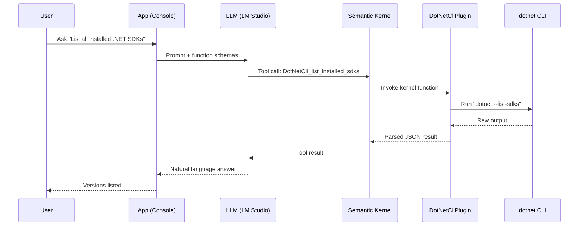
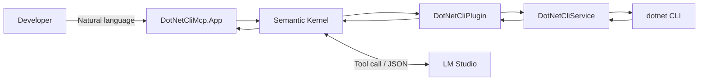

# Prompt to .NET CLI with MCP

A .NET 9 sample that turns natural language into `dotnet` CLI commands via Semantic Kernel + local LLM, enabling AI-powered interactions with your .NET environment.

## How It Works

> **TL;DR;**: the LLM selects an MCP function, Semantic Kernel auto-invokes it, results are returned and summarized into a concise answer.

```bash
dotnet run --project src/DotNetCliMcp.App

[16:32:43 INF] Starting Prompt to .NET CLI with MCP
[16:32:43 INF] Semantic Kernel initialized with 1 plugins
[16:32:43 INF] Available functions: get_dotnet_info, list_installed_sdks, list_installed_runtimes, check_sdk_version, get_latest_sdk, get_effective_sdk
[16:32:43 INF] === Prompt to .NET CLI with MCP ===
[16:32:43 INF] Connected to LM Studio at: http://127.0.0.1:1234/v1
[16:32:43 WRN] Note: Make sure LM Studio is running with a model loaded
[16:32:43 INF] Type your questions about .NET SDK/Runtime (or 'exit' to quit)
[16:32:43 INF] 
You: List all installed .NET SDKs
[16:32:44 INF] Processing user query: List all installed .NET SDKs
Assistant: ....
[16:32:51 INF] Plugin function list_installed_sdks invoked
[16:32:51 INF] Executing dotnet --list-sdks
[16:32:51 INF] Found 9 installed SDKs
You have 9 .NET SDK versions installed. Here's the list:

- Version: 6.0.419, Path: /usr/local/share/dotnet/sdk
- Version: 8.0.120, Path: /usr/local/share/dotnet/sdk
- Version: 8.0.303, Path: /usr/local/share/dotnet/sdk
- Version: 8.0.403, Path: /usr/local/share/dotnet/sdk
- Version: 8.0.404, Path: /usr/local/share/dotnet/sdk
- Version: 9.0.100, Path: /usr/local/share/dotnet/sdk
- Version: 9.0.103, Path: /usr/local/share/dotnet/sdk
- Version: 9.0.203, Path: /usr/local/share/dotnet/sdk
- Version: 9.0.302, Path: /usr/local/share/dotnet/sdk
```


## Features

- **Local LLM Integration**: Connects to LM Studio for privacy-focused AI interactions
- **DotNet CLI Wrapper**: Query SDK versions, runtimes, and environment details
- **MCP Functions**: Semantic Kernel plugin with tool calling support
- **Configuration Providers**: Uses appsettings.json and environment variables for flexible configuration
- **Enhanced System Prompts**: Optimized prompts for better tool calling and reasoning suppression
- **Structured Logging**: Serilog with console and file output
- **Comprehensive Testing**: xUnit 3 with NSubstitute mocking

## Architecture



## Prerequisites

- .NET 9.0 SDK
- [LM Studio](https://lmstudio.ai/) with a loaded model at `http://127.0.0.1:1234/v1`

## Quick Start

```bash
# One-shot setup (requires pwsh)
pwsh -File scripts/setup-collaborator.ps1

# Or manually
dotnet build
dotnet run --project src/DotNetCliMcp.App
```

Example queries:
- "List all installed .NET SDKs"
- "Do I have .NET 8.0.202 SDK?"
- "What's my current SDK version?"

## Available MCP Functions

The following functions are exposed to the LLM:

| Function | Description |
|----------|-------------|
| `get_effective_sdk` | Get the effective .NET SDK version in use ⭐ |
| `get_dotnet_info` | Get comprehensive .NET environment information |
| `list_installed_sdks` | List all installed .NET SDKs |
| `list_installed_runtimes` | List all installed runtimes |
| `check_sdk_version` | Check if a specific SDK version is installed |
| `get_latest_sdk` | Get the latest installed SDK version |

⭐ = Respects `global.json` configuration

## Project Structure

```
cli-mcp/
├── src/
│   ├── DotNetCliMcp.App/
│   │   ├── Infrastructure/         # Configuration, logging
│   │   └── Program.cs              # SK setup + chat loop
│   └── DotNetCliMcp.Core/
│       ├── Contracts/              # DTOs (DotNetInfo, SdkInfo, RuntimeInfo)
│       ├── Services/               # IDotNetCliService, DotNetCliService
│       └── Plugins/                # DotNetCliPlugin (MCP functions)
├── tests/
│   └── DotNetCliMcp.Core.Tests/
│       ├── Integration/            # LLM interaction tests
│       └── Services/               # Unit tests
└── Mcp.DotNet.CliWorkshop.sln
```

## Configuration

Edit `src/DotNetCliMcp.App/appsettings.json` or use environment variables:

```bash
export OpenAI__Endpoint="http://127.0.0.1:1234/v1"
export OpenAI__Model="your-model-name"
export OpenAI__ApiKey="not-needed"
export OpenAI__Temperature="0.2"
```

Logs: `logs/mcp-dotnet-cli-workshop-{Date}.log` (daily rolling)

## Development

```bash
dotnet test
dotnet format
```

## Technology Stack

- .NET 9.0 (file-scoped namespaces, primary constructors)
- Semantic Kernel 1.65+ (function calling, auto-invoke)
- Microsoft.Extensions.AI
- Serilog 4.x
- xUnit 3 + NSubstitute

## License

MIT License - See LICENSE file for details
