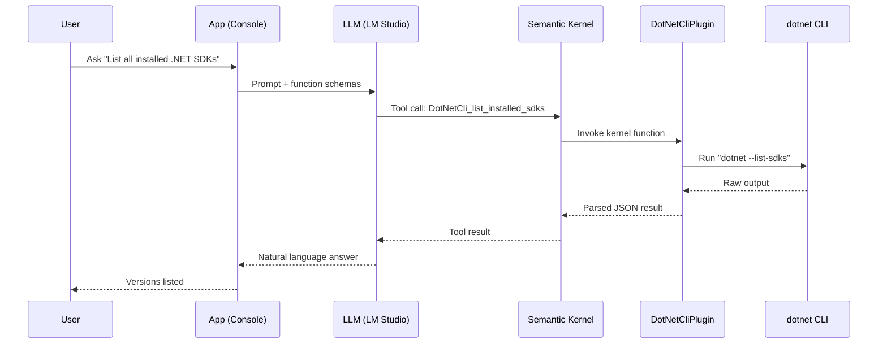
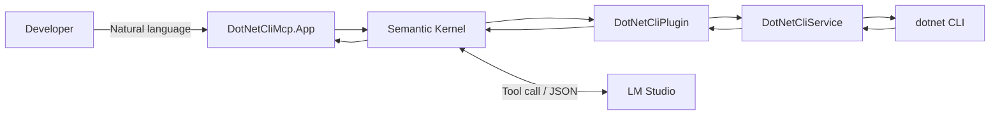

# Prompt to .NET CLI with MCP

A .NET 9 sample that turns natural language into `dotnet` CLI commands via Semantic Kernel + local LLM, enabling AI-powered interactions with your .NET environment.

## How It Works

> **TL;DR;**: the LLM selects an MCP function, Semantic Kernel auto-invokes it, results are returned and summarized into a concise answer. You can use your native language to ask questions about your .NET environment.

- The LLM chooses an MCP function based on your question.
- Semantic Kernel auto-invokes the function and returns structured results.
- The app summarizes the results into a concise answer.

```bash
dotnet run --project src\DotNetCliMcp.App\DotNetCliMcp.App.csproj

[18:41:15 INF] Starting Prompt to .NET CLI with MCP
[18:41:15 INF] Semantic Kernel initialized with 1 plugins
[18:41:15 INF] Available functions: get_dotnet_info, list_installed_sdks, list_installed_runtimes, check_sdk_version, get_latest_sdk, get_effective_sdk
[18:41:15 INF] === Prompt to .NET CLI with MCP ===
[18:41:15 INF] Connected to LM Studio at: http://127.0.0.1:1234/v1
[18:41:15 INF] HTTP timeout: 300s (0=infinite), Connect timeout: 15s
[18:41:15 WRN] Note: Make sure LM Studio is running with a model loaded
[18:41:15 INF] Type your questions about .NET SDK/Runtime (or 'exit' to quit)
[18:41:15 INF] 
You: list all my installed .net runtimes
[18:41:24 INF] Processing user query: list all my installed .net runtimes

Assistant: \[18:41:25 INF] Plugin function list_installed_runtimes invoked
[18:41:25 INF] Executing dotnet --list-runtimes
[18:41:25 INF] Found 9 installed runtimes
You have the following .NET runtimes installed:

- **Microsoft.AspNetCore.App** 8.0.19  
- **Microsoft.AspNetCore.App** 9.0.8  
- **Microsoft.AspNetCore.App** 10.0.0‑preview.7.25380.108  

- **Microsoft.NETCore.App** 8.0.19  
- **Microsoft.NETCore.App** 9.0.8  
- **Microsoft.NETCore.App** 10.0.0‑preview.7.25380.108  

- **Microsoft.WindowsDesktop.App** 8.0.19  
- **Microsoft.WindowsDesktop.App** 9.0.8  
- **Microsoft.WindowsDesktop.App** 10.0.0‑preview.7.25380.108  

All are located under `C:\Program Files\dotnet\shared`.
```

### You can have fun

```console
# Example (Polish)
User: jaki dzisiaj jest dzień tygodnia?
Assistant: Dziś jest niedziela.
```



## Features

- **Local LLM Integration**: Connects to LM Studio for privacy-focused AI interactions
- **DotNet CLI Wrapper**: Query SDK versions, runtimes, and environment details
- **MCP Functions**: Semantic Kernel plugin with tool calling support
- **Configuration Providers**: Uses appsettings.json and environment variables for flexible configuration
- **Enhanced System Prompts**: Optimized prompts for better tool calling and reasoning suppression
- **Structured Logging**: Serilog with console and file output
- **Comprehensive Testing**: xUnit 3 with NSubstitute mocking

## Architecture



## Prerequisites

- .NET 9.0 SDK
- [LM Studio](https://lmstudio.ai/) with a loaded model at `http://127.0.0.1:1234/v1`

## Quick Start

```bash
# One-shot setup (requires pwsh)
pwsh -File scripts/setup-collaborator.ps1

# Or manually
dotnet build
dotnet run --project src/DotNetCliMcp.App
```

Try prompts:
- List all installed .NET SDKs
- Do I have .NET 8.0.413 installed?
- Jaki jest mój aktualny SDK?

## Available MCP Functions

The following functions are exposed to the LLM:

| Function | Description |
|----------|-------------|
| `get_effective_sdk` | Get the effective .NET SDK version in use * |
| `get_dotnet_info` | Get comprehensive .NET environment information |
| `list_installed_sdks` | List all installed .NET SDKs |
| `list_installed_runtimes` | List all installed runtimes |
| `check_sdk_version` | Check if a specific SDK version is installed |
| `get_latest_sdk` | Get the latest installed SDK version |

* = Respects `global.json` configuration

## Project Structure

```
cli-mcp/
├── src/
│   ├── DotNetCliMcp.App/
│   │   ├── Infrastructure/         # Configuration, logging
│   │   └── Program.cs              # SK setup + chat loop
│   └── DotNetCliMcp.Core/
│       ├── Contracts/              # DTOs (DotNetInfo, SdkInfo, RuntimeInfo)
│       ├── Services/               # IDotNetCliService, DotNetCliService
│       └── Plugins/                # DotNetCliPlugin (MCP functions)
├── tests/
│   └── DotNetCliMcp.Core.Tests/
│       ├── Integration/            # LLM interaction tests
│       └── Services/               # Unit tests
└── Mcp.DotNet.CliWorkshop.sln
```

## Configuration

Edit `src/DotNetCliMcp.App/appsettings.json` or use environment variables:

```bash
export OpenAI__Endpoint="http://127.0.0.1:1234/v1"
export OpenAI__Model="your-model-name"
export OpenAI__ApiKey="not-needed"
export OpenAI__Temperature="0.2"
```

Logs: `logs/mcp-dotnet-cli-workshop-{Date}.log` (daily rolling)

## Development

```bash
dotnet test
dotnet format
```

## Technology Stack

- .NET 9.0 (file-scoped namespaces, primary constructors)
- Semantic Kernel 1.65+ (function calling, auto-invoke)
- Microsoft.Extensions.AI
- Serilog 4.x
- xUnit 3 + NSubstitute

## License

MIT License - See LICENSE file for details
